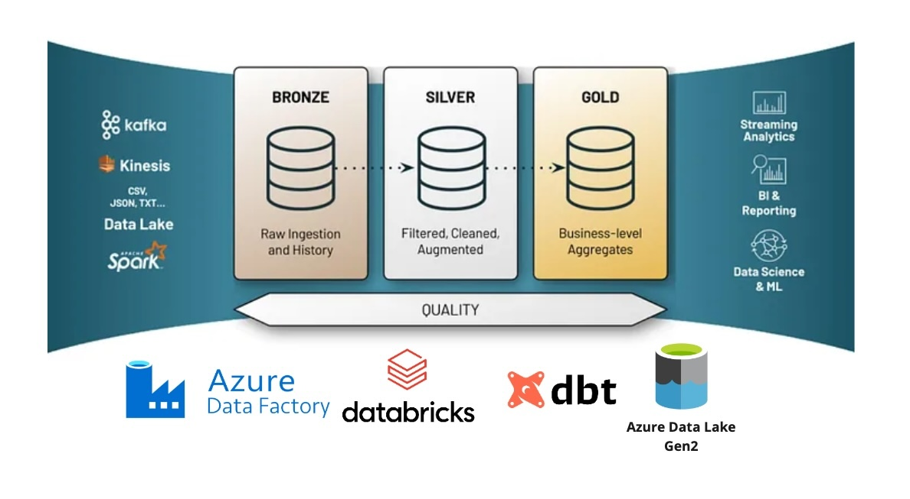

# Modern Data Engineering with Medallion Architecture using DBT, Databricks, Spark, and Azure Cloud

Welcome to my modern data engineering project! 🚀  
This project demonstrates an **end-to-end data pipeline** using **Azure Databricks**, **Apache Spark**, **DBT**, and **Azure Data Factory**, following the **Medallion Architecture**.

---

## System Architecture

---

### Try running the following commands
- `dbt run` — run all models  
- `dbt test` — run tests on models  
- `dbt snapshot` — capture snapshots (Slowly Changing Dimensions)  
- `dbt docs generate` — generate project documentation  
- `dbt docs serve` — preview documentation locally  

---

### Resources
- Learn more about **dbt** in the [docs](https://docs.getdbt.com/docs/introduction)  
- Explore **dbt Discourse** for FAQs and tips: [link](https://discourse.getdbt.com/)  
- Join the community [Slack chat](https://community.getdbt.com/)  
- Find upcoming [dbt events](https://events.getdbt.com)  
- Read the [dbt blog](https://blog.getdbt.com/) for best practices
